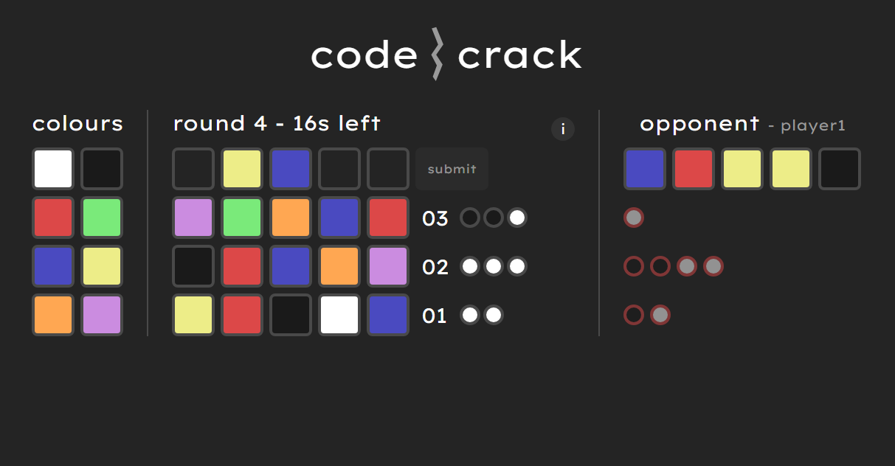

# codecrack

### an online multiplayer mastermind spinoff

# how to play

the game is based on the popular mastermind board game, but instead using two games at once

the aim of the game is to guess the opponent's colour code before they can guess yours

players can input guesses and receive feedback of how close their guess was using black and white pegs (more info in game)

# how it works

the game operates using a go server and a react client which communicate using a custom websocket protocol 

# hosting instructions

go 1.18 or newer and node.js are required to be installed

### 1. build the client (run in client directory)
```
npm run build
```

### 2. compile the server (run in main directory)
```
go build .
```

### 3. run the server executable (port is configurable)
```
./mastermind.exe -c -port=80
```